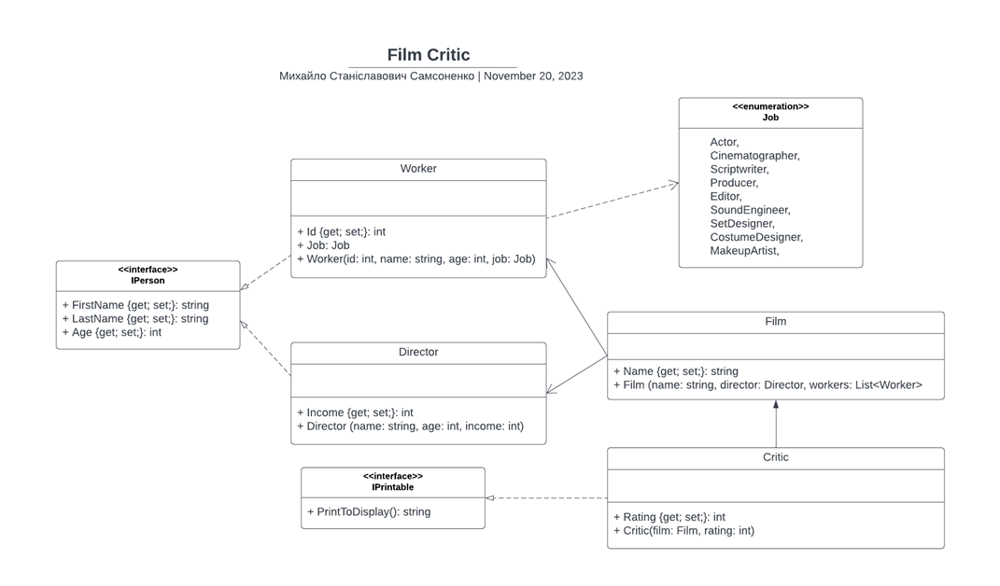

# Film Critic

**Ідея проекту**: Ми критик фльмів котрий ставить оцінки, від 0 до 5

Діаграма класу:

## Опис класів
- Critic – ставиться оцінка фільму.
- Film – привласнюється назва фільму та визначається режисер із робітниками
- Director – привласнюється ім’я, прізвище та вік, визначаємо дохід режисера
- Worker – ставимо id, привласнюємо ім’я, прізвище та вік, визначаємо вид роботи

## Опис методів
- PrintToDisplay - повертає рядок який потім виводиться через Console.WriteLine()
